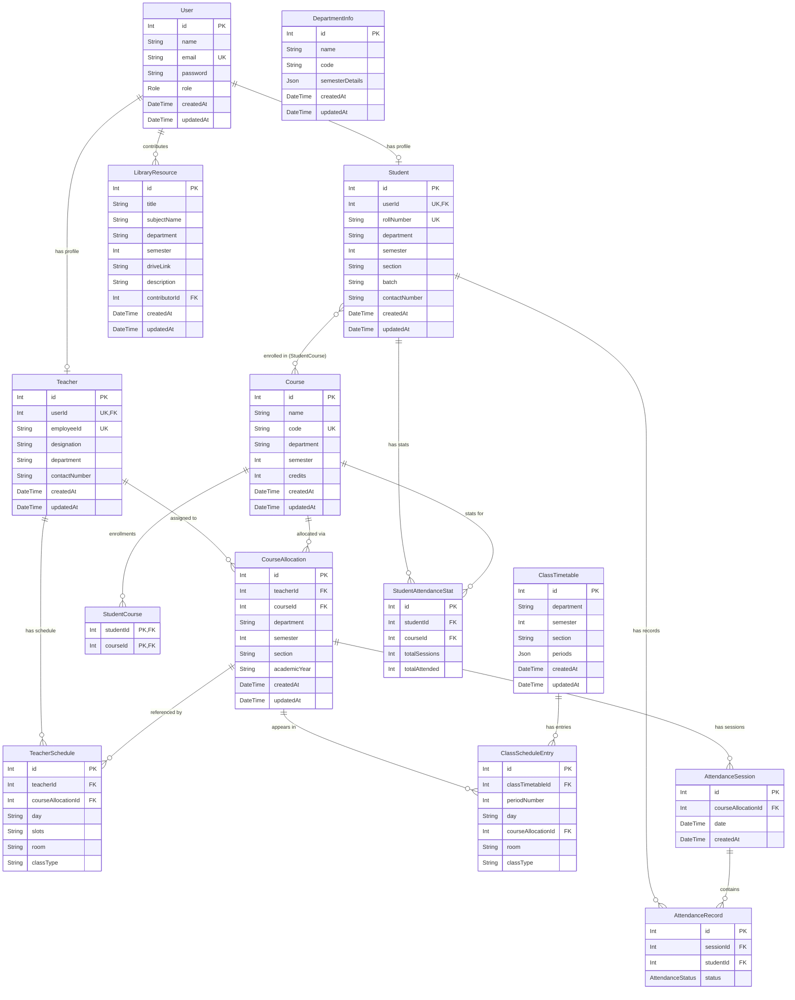

# MyAttendance

A full-stack attendance management system built for academic workflows, with dedicated experiences for students, teachers, and admins.

## Overview

MyAttendance is a role-based web application that helps institutions manage attendance, class schedules, course allocations, reporting, and study resources from one platform.

The project includes:

- `Admin` tools for managing students, teachers, courses, allocations, schedules, users, and reports
- `Teacher` tools for starting live attendance sessions, reviewing past sessions, and viewing weekly teaching schedules
- `Student` tools for checking per-subject attendance, class routine, recent records, and low-attendance warnings
- `Library` tools for browsing and sharing academic resources

## Key Features

- Role-based authentication and authorization for `ADMIN`, `TEACHER`, and `STUDENT`
- Student, teacher, course, and course-allocation management
- Live attendance taking with per-session submission
- Attendance reports with session details and defaulter tracking
- Admin-managed class timetable and section-wise class routine
- Teacher-specific weekly planner derived from class schedule entries
- Student dashboard with overall attendance, subject-wise attendance, and course details
- Shared attendance detail modal across admin, student, and teacher flows
- Community library with filterable academic resources
- Light and dark mode across the application
- Responsive UI with mobile navigation and mobile-friendly attendance-taking flow

## Tech Stack

### Frontend

- React
- React Router
- Tailwind CSS
- Axios
- Lucide React
- React Hot Toast

### Backend

- Node.js
- Express
- Prisma ORM
- MySQL
- bcryptjs

## Project Structure

```text
The_Attandence_Project/
├── Backend/
│   ├── controllers/
│   ├── middlewares/
│   ├── prisma/
│   ├── routes/
│   ├── utils/
│   └── app.js
├── Frontend/
│   ├── src/
│   │   ├── api/
│   │   ├── Components/
│   │   ├── contexts/
│   │   └── hooks/
│   └── vite.config.js
└── README.md
```

## Major Modules

### Admin

- Dashboard metrics and recent sessions
- CRUD for students, teachers, and courses
- Course allocation management
- Class timetable and class schedule management
- Attendance reports and defaulter reports
- User and role management

### Teacher

- Dashboard with teaching allocations
- Today’s classes and weekly schedule
- Live attendance session flow
- Past attendance sessions and allocation-wise history

### Student

- Attendance summary and low-attendance alerts
- Per-course attendance history
- Attendance calendar
- Section-wise class routine

### Library

- Filter by department, semester, and subject
- Share study materials
- View community-contributed resources

## Authentication and Authorization

The app now includes:

- Access-token based authentication
- Refresh-session flow
- Route protection on frontend and backend
- Role-based access control
- Ownership checks for teacher and student routes

Backend auth endpoints:

- `POST /api/auth/login`
- `POST /api/auth/refresh`
- `POST /api/auth/logout`
- `GET /api/auth/me`
- `POST /api/auth/change-password`

## Setup

### 1. Clone the repository

```bash
git clone <your-repo-url>
cd The_Attandence_Project
```

### 2. Install backend dependencies

```bash
cd Backend
npm install
```

### 3. Install frontend dependencies

```bash
cd ../Frontend
npm install
```

### 4. Configure environment variables

Create a `.env` file for the backend and add values like:

```env
DATABASE_URL="your_database_url"
PORT=5000
NODE_ENV=development
ACCESS_TOKEN_SECRET=change_this_access_secret
REFRESH_TOKEN_SECRET=change_this_refresh_secret
ACCESS_TOKEN_EXPIRES_IN=15m
REFRESH_TOKEN_EXPIRES_IN=7d
```

### 5. Run Prisma setup

```bash
cd Backend
npx prisma generate
npx prisma db push
node prisma/seed.js
```

### 6. Start the backend

```bash
cd Backend
node app.js
```

### 7. Start the frontend

```bash
cd Frontend
npm run dev
```

## Demo Flow

1. Log in with an admin account
2. Create students, teachers, and courses
3. Create course allocations
4. Build class schedules
5. Log in as a teacher and take attendance
6. Log in as a student and review attendance history and class routine

# MyAttendance — Schema Relation Diagram



## Entity Overview

| Entity                  | Purpose                                                    |
| ----------------------- | ---------------------------------------------------------- |
| `User`                  | Core auth entity — all logins go through here              |
| `Student`               | Profile linked 1-to-1 with a User (role = STUDENT)         |
| `Teacher`               | Profile linked 1-to-1 with a User (role = TEACHER)         |
| `DepartmentInfo`        | Standalone department metadata (no FK relations)           |
| `Course`                | Subject/paper definition                                   |
| `StudentCourse`         | M-to-M join table: which students enrolled in which course |
| `CourseAllocation`      | "Who teaches what, to whom" — central hub entity           |
| `TeacherSchedule`       | Teacher's personal day/slot schedule                       |
| `ClassTimetable`        | Period structure per class (dept + sem + section)          |
| `ClassScheduleEntry`    | Individual cell in the timetable grid                      |
| `AttendanceSession`     | One class session (attendance header)                      |
| `AttendanceRecord`      | One student's present/absent status per session            |
| `StudentAttendanceStat` | Cached attendance percentage per student per course        |
| `LibraryResource`       | User-contributed Google Drive study links                  |

## Author

Built by Kushal001.
